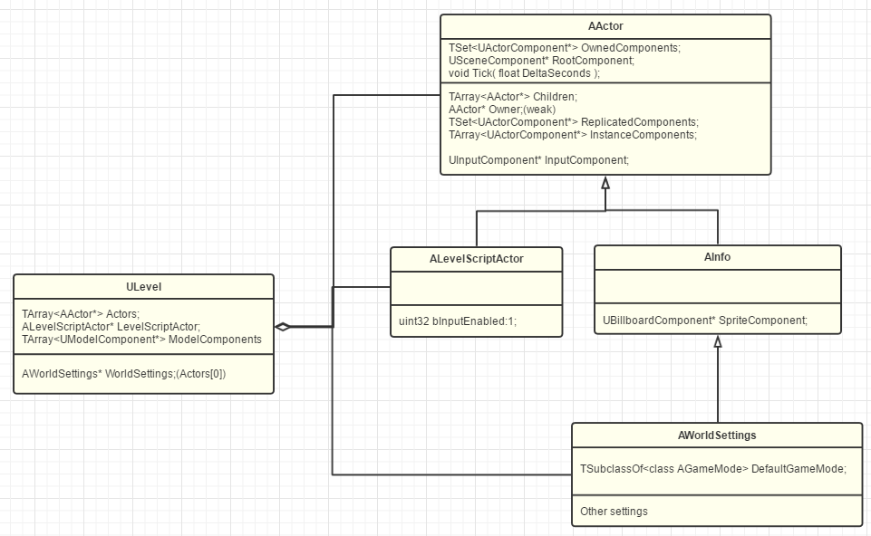
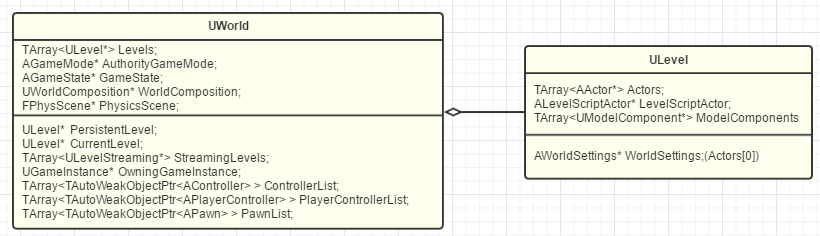
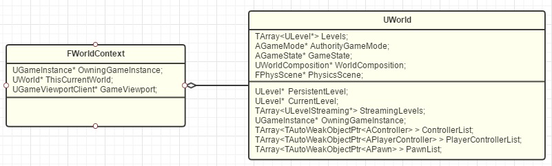
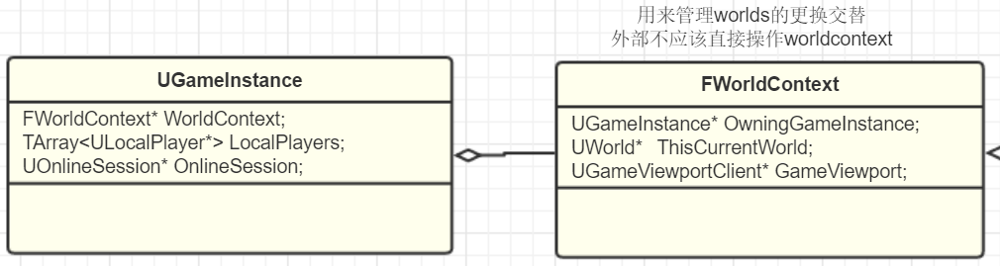
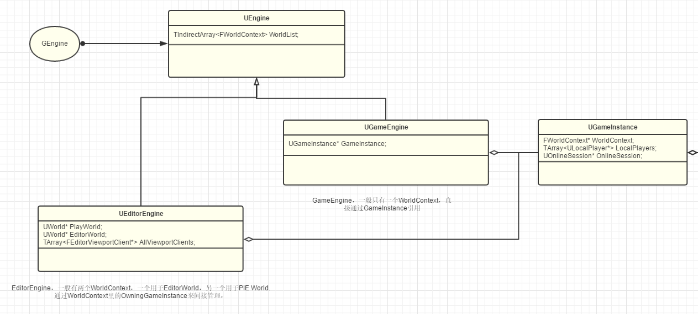
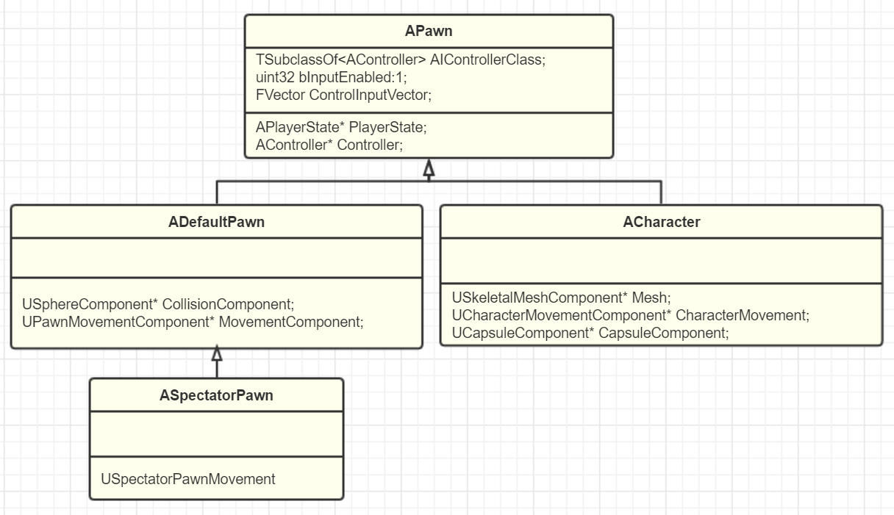
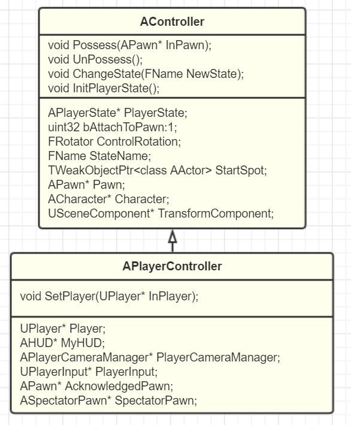
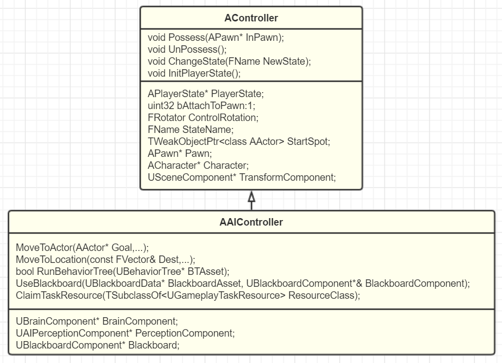

# GamePlay-GameFreamWork

## UEGameFreamWork

### Actor and Component

二者都继承于Uobject,actor在设计概念上有点类似于容器，它身上放置了一堆的component来实现各种功能，如在3d世界里面放置，实现actor的父子关系等各种功能，有两个容器存放各种的component，一个是set容器存放所有的component,一个是arrary数组存放实例化后的component.

actorcomponent是不能互相嵌套的，只有在scenecomponent上面才提供了嵌套功能，这点可以在ue的蓝图中就可以看出来。

### Level && World

#### Level

  可以看到level也是继承于uobject的，而在这副图的内容也很丰富，可以看到actor们全都存储在level里面，且继承自Ainfo的worldSettings放在Actors里面的第一个位置上，理由是非网络的actor放在前面，网络复制的actor放在后面，这相当于给网络复制的actor划分了缓存，加速了网络复制时的检测速度。

  在这张图中我们可以看到与Ulevel密切相关的两个actor，一个是AlevelScriptActor，它是关卡蓝图的父类。一个是继承自AInfo这种没有scenecomponent的AWorldSettings。

#### World

有两种方式操纵level和world使他们互相之间转变，一种是sublevel，一种是worldcomposition.具体实现不追究，观其本质，就是一个world有多个level，这些Level在什么位置，是在一开始就加载进来，还是Streaming运行时加载。

UE里每个World支持一个PersistentLevel（持久关卡）和多个其他Level：

Persistent的意思是一开始就加载进World，Streaming是后续动态加载的意思。Levels里保存有所有的当前已经加载的Level，StreamingLevels保存整个World的Levels配置列表。

PersistentLevel和CurrentLevel只是个快速引用。在编辑器里编辑的时候，CurrentLevel可以指向其他Level，但运行时CurrentLevel只能是指向PersistentLevel。

每一个world都有一个主PersistentLevel，它的意思是关于整个世界的配置可以在主level里的worldsettings里面设置，但是每一个level里面的个性化设置可以到单独的level里面设置。

### WorldContext,GameInstance,Engine

#### WorldContext

什么是worldContext呢？UE用来管理和跟踪这些World的工具。在这句话中你可以看到它没有保存World。但同样也透漏出一点消息就是world并不是唯一的，而worldcontext是唯一的。

上面的结论可以在这段代码中看出。Fworldcontext里存了一个Uworld的指针，指向当前的world.而当需要从一个World切换到另一个World的时候（比如说当点击播放时，就是从Preview切换到PIE），FWorldContext就用来保存切换过程信息和目标World上下文信息.而且level的切换也是在Fworld里面的。

为什么level的切换不放在world里面呢？

这是因为一个world只有一个主persistentlevel，当我们切换该level的时候，ue要释放当前world,然后加载下一个拥有主level的world。假如把level的切换放到world里，那就意味着你当前的world必须保存着下一个world的主level,这与引擎的设计不符合，不符合一个world拥有一个主level的设计。好，我们当然也可以将下一个world的主level当作普通level存放在当前的world，但是我们释放world的时候就不得不把当前的world放在一个临时对象中，相比直接加载world，这个损耗会大。

#### GameInstace

从前面的学习中我们知道，所有的component存放在actor的一个set容器里面，所有的actor存放在level里面，所有的level存放在world里，当前的world存放在FworldContext里面，那么FworldContext又存放在了哪里呢？

可以从代码里面看到，UGameInstace存放着Fworldcontext的指针，因为Fworldcontext是唯一的，所以指针就够了，不用数组。当然，UGameInstance不仅仅存放这一个东西，它存放着独立于level的的逻辑和数据。

#### Engine

可以从这张图片中看到，UGameEngine存放着一个UGameInstance的指针，这说明了UGameInstance也是唯一的，因为ue不支持同时运行多个world.

在UEngine里面可以看到它存放着一个FworldContext的数组，但是Fworldcontext不是唯一的吗，为什么他会有一个数组呢。在我看来，应该是FworldContext的指针指向一个world他就将该world放在这个数组里面，这样他就可以保存所有的world了。

UEngine上就剩下一个GEngine了，也就是根源了。至此，ue游戏世界的各个部分清楚了。

Object->Actor+Component->Level->World->WorldContext->GameInstance->Engine。

### pawn

#### Component

让我们再来看看这个component这个对象树最底层的东西，Component实现的是功能，我过去常常分不清什么是功能，什么是业务逻辑。这样说，Component实现的东西应该是可以无痛迁移到下一个游戏的，例如MovementComponent,它是一种游戏功能。什么是业务逻辑呢？所谓的游戏业务逻辑，实际上编写的就是该如何对玩家的输入提供反馈.这就很有意思，假如我按了B,我的背包会出现，这种就是游戏业务逻辑，它也是无法迁移到下一个游戏的。

#### Pawn

回到pawn,pawn就是可以移动的actor.它定义了三种基本的模板方法接口。

- 可被Controller控制
- PhysicsCollision表示
- MovementInput的基本响应接口

Pawn既然继承自Actor,那么它也就着重于在3d世界中表示，而不是被当成逻辑的载体，大钊的比喻非常巧妙，>  你也可以想象成提线木偶，那个木偶就是Pawn，而提线的是Controller .这下可以明白逻辑这类应该写在Controller之中会比较好。

Pawn可以响应输入，是因为其实在Actor里面就可以响应输入了，但响应后 的逻辑控制，这就是Pawn新加的内容，定义了响应移动的接口，之后的逻辑就交给了MovementComponent了。

#### ADefaultPawn

继承自Pawn的ADefaultPawn自带三件套，DefaultPawnMovementComponent、spherical CollisionComponent和StaticMeshComponent。不用每次都去手动的添加这些组件。

#### SpectatorPawn

可以看到它只有一个USpectatorPawnMovement（不带重力漫游），他就是FPS游戏中的观战系统。

#### ACharacter

同样的三件套，不同的配方罢了

### Controller

#### Acontroller

AController,继承自AActor,主要表达控制的概念，也就是写业务逻辑的地方，这很容易和pawn的逻辑搞混，哪些应该写在pawn,哪些应该写在controller里面呢？

主要还是看他们二者的概念上，pawn表达了能动，重点在能上面。controller表达了控制，重点是控制。我想可以表达自身能的东西放到pawn里里面，如碰撞检测，移动，播放动画的能力。controller则是控制，对于每一个pawn都使用的逻辑放在它身上。在战争游戏中，假设说有坦克和卡车两种战车（Pawn），只有坦克可以开炮，那么开炮这个功能你就可以直接实现在坦克Pawn上。而这两辆战车都有的自动寻找攻击目标功能，就可以实现在一个Controller里。可以看到controller里面是使用于所有的pawn的逻辑。

还例如，controller里面应该存放独立于pawn的数据，以便控制pawn的生死等。

所以分级一下，component>controller>pawn,功能应该在层级上这样划分。适用于多个游戏的>使用于多个pawn>使用于单个pawn的

#### AplayerState

AplayerState继承自Ainfo,它很简洁。且它是自动生成的。所以在切换关卡的时候会自动释放。基于这些特性，它应该存放着哪些数据呢？应该是玩家在本关卡的游玩数据。假如你这个关卡是个篮球比赛，那么各个玩家的得分就记录在AplayerState上面，且每一个玩家应该都有一个Aplayerstate。你希望一些数据只在本关卡有用，那么就写在那里吧。

#### APlayerController

关于playercontroller这里依旧是有个老问题,哪些逻辑写在这里合适呢？其实答案同controller一样罢了。

第二个问题是这里面带有些什么呢？

在他的cpp文件中的函数大概可以分成一下几类。

- Camera的管理
- input系统
- HUD显示
- UPlayer关联
- level切换
- voice

#### AAIController

同PlayerController对比，少了Camera、Input、UPlayer关联，HUD显示，Voice、Level切换接口，但也增加了一些AI需要的组件：

- Navigation，自动寻路系统，也就是move一类的接口
- AI组件，运行行为树，获取黑板数据等。
- Task系统，让AI去完成一些任务，也是实现GameplayAbilities系统的一个接口。目前简单来说GameplayAbilities是为Actor添加额外能力。属性集合的一个模块，比如HP，MP等

不同于playercontrol的是，它不是必须存在的。因为可能没有ai。所以我们可以在pawn上给它配置一个AIcontroller,当pawn产生的时候aicontroller就可以产生。

哪么哪些逻辑放在AIController里面呢？

同playerController一样，只不过不同的是，我们尽量将它的功能在其提供的AI组件里面完成
